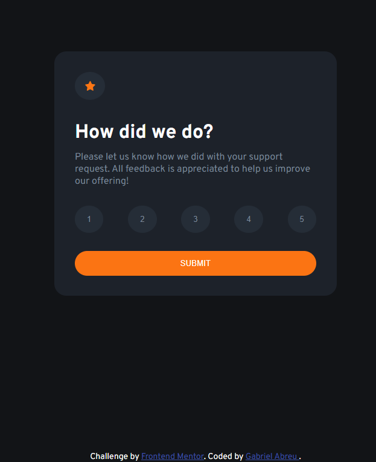

# Frontend Mentor - Solução do Product preview card component

Essa é uma solução para o desafio Interactive Rating Component do Frontend MentorIO.

## Sumário

- [Visão Geral](#visão-geral)
- [Foto](#foto)
- [Construção](#construído-com)
- [Autor](#autor)

## Visão Geral

Essa é uma solução bem simples contendo apenas HTML, CSS e JavaScript de um componente interativo com o usuário.

### Foto

Essa é uma foto de como ficou o desafio.

### Construído com

- HTML
- CSS 
- JavaScript
- Flexbox

## Autor

- Frontend Mentor - [@haltshow](https://www.frontendmentor.io/profile/haltshow)
- GitHub - [@haltshow](https://github.com/haltshow)
- GitLab - [@gabrielabreualves](https://gitlab.com/gabrielabreualves)
